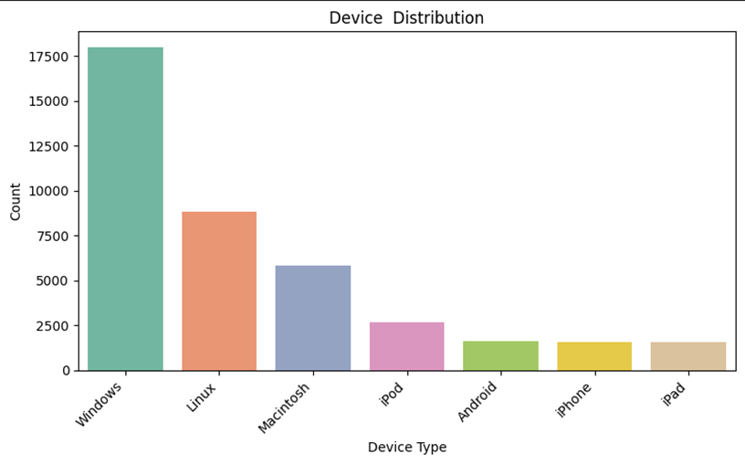
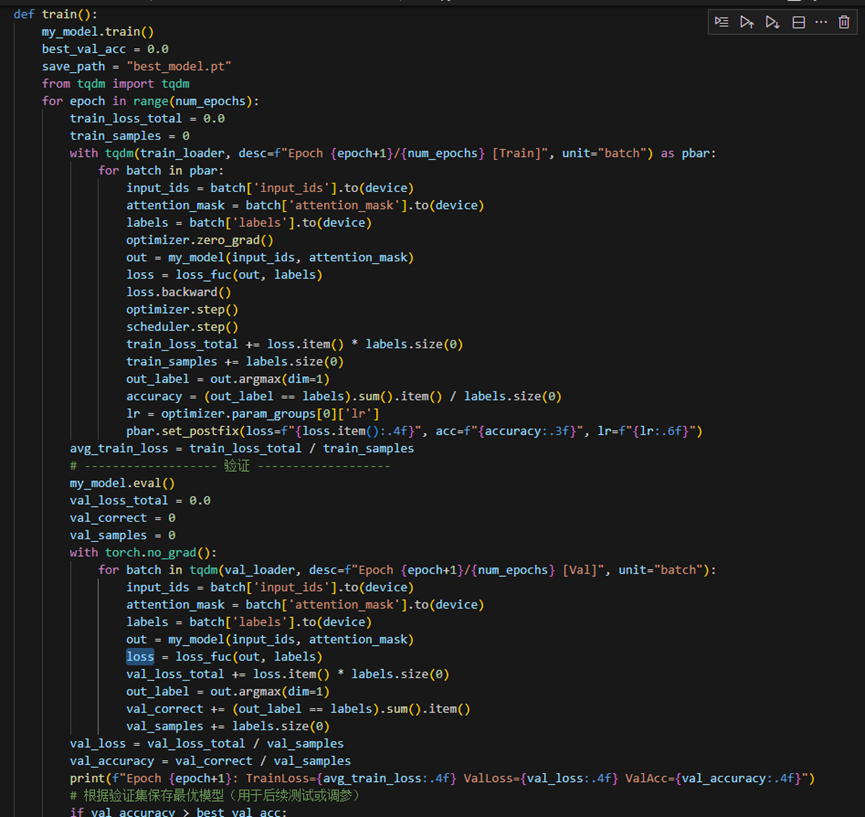

# 网络攻击类型识别

人工智能-殷洪友-12025215168

## 数据处理与预览

### 数据基本信息

导入数据后通过查看数据相关信息，其中数据shape为(40000,25)，缺失数据如图1.1所示,从图可以看出只有Malware Indicators、Alerts/Warnings、Proxy Information、Fire Logs、IDS/IPS Alerts字段有缺失。数值类字段统计信息如图1.2所示。

图1.1

图1.2

### 空数据处理

因为为自然语言任务，所以这里的空数据我们直接根据字段的含义来进行填充，如图1.3所示

图 1.3

### Device Information字段处理

因为Device Information字段中包含了太多无用信息，因此我们进行信息的提取，将设备信息提取到Device字段中，如图1.4所示，可以清楚发现来自于Windows的工具占大多数。然后将Device Inforamation中的浏览器信息提取到Browser中，如果1.5所示

图 1.4

图 1.5

### 时间字段的处理

从图1.7和图1.8 我们可以看出工具类型在时间的分布上很均匀，因此我们直接把时间字段Timestamp进行了删除。

图1.6

图 1.7

### Protocol字段与Attack Type组合频率

因为Protocol为有限的值，我们统计了不同的Protocol与Attack Type的组合出现的频率，如图1.8所示。从图我们可以清楚的发现频率分布很均匀，也就是说起始Protocol字段对Attack Type的类型贡献的信息量很少，约等于没有，因此我们可以把这个字段直接删除，但后面我们发现很多字段贡献的信息量都很少，因此最后的实验中我们选择了保留此字段。

图 1.8

### Source Port, Destination Port, Packet Length, Anomaly Scores与Attack Type的箱型图

如图1.9 所示 这些字段与Attack Type字段的箱型图高度基本是一致的，也就说这些字段的不同类型对于Attack Type的预测能力很低。

图 1.9

### 一些字段的删除

通过查阅相关网络安全的文档 我们删除了一些与网络攻击相关性不大的字Source IP Address、Destination IP Address、Timestamp、Log Source、User Information

Device Information

## 数据集划分

根据要求，我们将数据集划分为训练集、验证集、测试集比例为7:2:1,并使用huggingface的Dataset来构建Loader数据其中设计批次大小为32,处理后训练集的批次为875,验证集的批次为125，测试集的批次为250。

## 模型的构建

在本次任务中我们选择google-bert/bert-base-uncased预训练模型并进行微调。模型的定义如图3.1所示。

模型参数说明:

1. bert_model:预训练模型
2. num_labels:分类个数
3. dropout:Dropout池化比例
4. unfreeze_last_n:bert-base-uncase参与更新的层数，从后往右

在MyModel中我们对bert-base-uncased的池化输出进行处理。处理顺序如下:

Dropout池化层:惊醒池化处理，参数p在模型创建的时候传递，本次中我们的p值为0.3

Linear线性层:此线性层的神经元为（768,384）

Relu激活函数：线性层处理后我们采用Relu激活函数进行非线性处理

LayerNorm:归一化层

Linear 线性层:神经元为（384,3）

图 3.1

## 模型的训练与验证

构建模型后我们开始训练，总共3个epoch，并在每个epoch后进行验证用于保存最后的模型。如图4.1

图 4.1

经过三轮训练后，我们发现训练最后精度为33.57%，效果并不好，但我们尝试去修改模型超参或者重新处理数据集得到的结果都差不多。如图4.2所示。

图4.2

## 模型的测试

得到训练后的模型后我们将测试集来进行测试，最后测试精度为33.5%,，如图5.1所示。

图5.1
